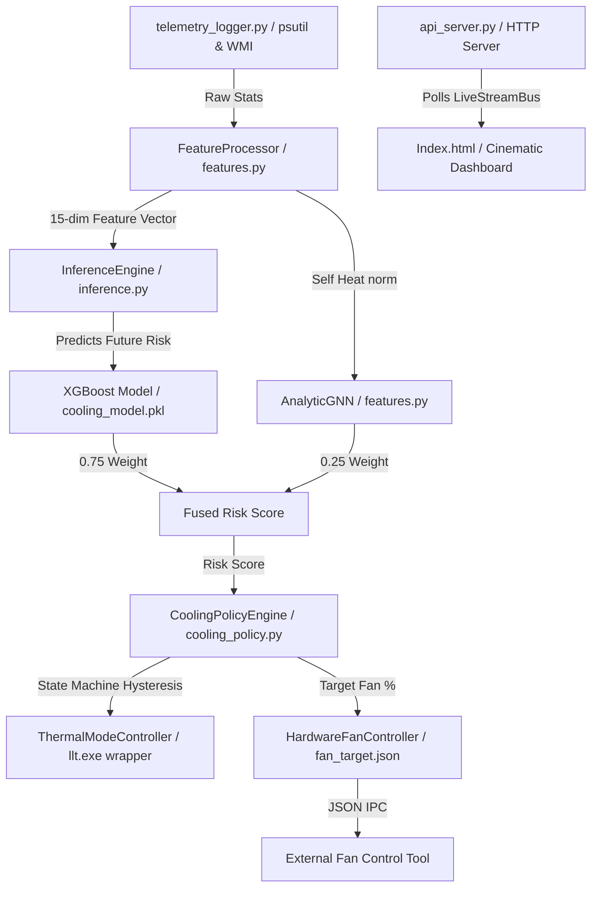

# ARCHITECTURE.md - Predictive Cooling System Architecture

This document details the software architecture, execution flow, core components, technical tradeoffs, and known code quirks of the **AI-Driven Sensor-Free Predictive Cooling System**.

---

## 🗺️ System Overview

The system is designed as a local telemetry-driven closed-loop controller. It monitors physical resource usage, predicts future thermal risk, and orchestrates fan/hardware performance profiles.



---

## 🔄 Execution & Data Flow

1. **Telemetry Collection** (`src/telemetry_logger.py` & `src/inference.py`):
   - Every 1.0 second, `psutil` reads CPU usage, virtual memory usage, and I/O byte rates.
   - Under Windows, a PowerShell WMI query reads CPU Package Power and temperature.
   - Spawns `nvidia-smi` to extract GPU utilization, temperature, and power.
   
2. **Stateful Feature Extraction** (`src/features.py`):
   - A unified `FeatureProcessor` consumes raw telemetry and generates a **15-dimensional vector**:
     - *Base Normalization [0-2]*: CPU, GPU, Memory utilization normalized to `[0.0, 1.0]`.
     - *I/O Log Scaling [3-4]*: Disk and network byte rates log-scaled $\log(1 + x) / \text{max\_log}$ and clipped to `[0.0, 1.0]`.
     - *Heat Proxy [5]*: Blended index $0.6 \times \text{CPU} + 0.4 \times \text{GPU}$.
     - *Rolling Windows [6-11]*: 5-second and 10-second averages of CPU, GPU, and Heat Proxy maintained via stateful `collections.deque` buffers.
     - *Deltas [12-14]*: First-order changes ($X_t - X_{t-1}$).
     
3. **Dual Model Scoring**:
   - **XGBoost Regressor** (`training/xgboost_model.py`): Evaluates the 15-dimensional feature vector to forecast thermal risk 30 seconds into the future ($y_{t+30}$).
   - **AnalyticGNN** (`src/features.py`): Models spatial heat propagation across adjacent logical racks by averaging the target rack's heat with its neighbors: $\text{GNN} = 0.7 \times \text{Self} + 0.3 \times \text{Average}(\text{Neighbors})$.
   
4. **Risk Fusion** (`src/core/fusion.py`):
   - Fuses the model scores via a weighted sum:
     $$\text{Risk Score} = 0.75 \times \text{XGBoost} + 0.25 \times \text{AnalyticGNN}$$
   - Maps the continuous score into risk levels: `LOW` (<0.35), `MED` (<0.55), `HIGH` (<0.75), and `CRITICAL` ($\ge$ 0.75).

5. **Policy Orchestration** (`src/thermal_mode_controller.py`):
   - The `ThermalModeController` state machine evaluates the risk score.
   - Adjusts operational modes: `QUIET` (30% Fan), `BALANCED` (55% Fan), `PERFORMANCE` (85% Fan), `FAILSAFE` (100% Fan), or `SILENT_RECOVERY` (45% Fan).
   - Prevents fan oscillation via hold-times (e.g. 15-30s) and state cooldown locks (max 5 switches in 120s).

6. **Actuation & IPC** (`src/hardware/thermal_mode_controller.py` & `src/fan_controller.py`):
   - Acts on hardware modes by spawning Lenovo Legion Toolkit (`llt.exe`) commands if available.
   - Writes fan speeds to `runtime/fan_target.json` for external actuation software (e.g., *FanControl*).

---

## 📦 Core Component Map

- **`src/features.py`**: **Single Source of Truth** for feature definitions and processing. Ensures strict training-serving parity. Houses `FeatureProcessor` and `AnalyticGNN`.
- **`src/core/fusion.py`**: Hardcoded weights and validation limits for combining models, mapping risk thresholds, and testing vectors.
- **`src/inference.py`**: Production runtime entrypoint containing the telemetry loop and sensor exception fallbacks.
- **`src/thermal_mode_controller.py`**: The main control policy. Calculates adaptive EMA smoothing, power transients, and state hysteresis.
- **`runtime/live_runtime_manager.py`**: Handles orchestration threads, dashboard publishing, and replay/simulation logic.
- **`runtime/api_server.py`**: Basic HTTP API serving live JSON telemetry on port 8080.
- **`Index.html`**: A cinematic dashboard visualizing fan RPM, CPU/GPU status, thermal predictions, and decision events.

---

## ⚖️ Technical Decisions & Tradeoffs

### 1. XGBoost vs. Deep Neural Networks (GNN/LSTM)
- **Decision**: XGBoost was selected for the primary tabular forecasting task.
- **Tradeoffs**:
  - *Pros*: Sub-millisecond inference on a single CPU thread; interpretable feature importances (crucial for IP/patent documentation); requires no CUDA or heavy PyTorch libraries.
  - *Cons*: Cannot natively ingest unstructured graphs, requiring a decoupled GNN fusion layer.
  - *GNN Split*: A full PyTorch Geometric GraphSAGE model is trained offline (`training/research/gnn_model.py`) for validation, while a simplified, dependency-free mathematical distillation (`AnalyticGNN`) runs online to keep the 1-second control loop lightweight.

### 2. Spawning CLI Subprocesses
- **Decision**: System stats are gathered via CLI subprocesses (`nvidia-smi` and PowerShell WMI queries) instead of low-level DLL drivers.
- **Tradeoffs**:
  - *Pros*: Platform abstraction; runs in user space; avoids writing kernel drivers.
  - *Cons*: Spawning interpreters every second adds significant CPU overhead (consuming up to 5-10% CPU just for monitoring) and creates execution jitter.

### 3. Decoupled JSON Actuation
- **Decision**: Fan targets are written to `runtime/fan_target.json` rather than directly rewriting firmware register bytes.
- **Tradeoffs**:
  - *Pros*: Prevents python runtime from requiring administrator kernel-write privileges; isolates hardware drivers from controller logic.
  - *Cons*: Relies on third-party daemon utilities (like *FanControl*) to poll the JSON and write to physical fan registers.

---

## ⚠️ Known Quirks & Code Compromises

Developers working on this repository should be aware of the following quirks:

### 1. Look-Ahead Oracle Simulation ("Cheating")
In `training/thermal_simulator.py`, the benchmarks indicating that the predictive fan outperforms the reactive fan utilize future look-ahead data rather than the model's actual predictions:
```python
if predictive_fan and i < n_steps - 30:
    future_cpu_t_proxy = 35.0 + 0.5 * cpu_ewma[i+30]
```
The simulator sets the fan speed at step `i` by reading future telemetry from step `i+30` directly, which acts as a perfect foresight oracle.

### 2. Negative Delta Feature Suppression
In `src/features.py`, the engineered delta features (representing the rate of change of CPU/GPU utilization) are clipped:
```python
vector = np.clip(vector, 0.0, 1.0)
```
Because resource utilization deltas ($X_t - X_{t-1}$) are negative when usage drops, clipping the entire vector to `[0.0, 1.0]` forces all negative changes to exactly `0.0`. Consequently, the model cannot distinguish between stable high utilization and utilization that is actively dropping.

### 3. Indefinitely Inflated Lead-Time Metric
In `runtime/live_leadtime_monitor.py`, the lead-time metric is calculated as the delta between the latest high-temperature event and the *first* high-risk prediction ever recorded since the process launched:
```python
earliest_valid = valid_preds[0]["timestamp"]
self.current_lead_time = latest_event - earliest_valid
```
Over long sessions, this lead-time metric continuously inflates (e.g., showing 5 hours of lead time if a spike occurs 5 hours after startup), rather than calculating local lead time for the nearest preceding event.

### 4. Lenovo Legion Toolkit Dependency
Actuation requires Lenovo Legion Toolkit (`llt.exe`). If the toolkit CLI is not present or is run on non-Lenovo hardware, the driver interface degrades to mock operations, running strictly in-memory without making physical hardware mode changes.
