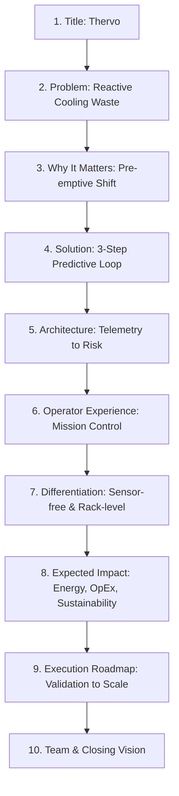

# Thervo — Investor & Technical Pitch Deck
**Yuva Yodha Tech Challenge | Smart Buildings Category**

> [!NOTE]
> **Project Name**: Thervo  
> **Core Concept**: AI-driven, sensor-free predictive cooling system for data centers  
> **Presentation Length**: Exactly 10 Slides  
> **Target Audience**: Yuva Yodha Tech Challenge Jury (Technical & Non-Technical Evaluators)

---


---

## Slide-by-Slide Deck Overview



---

### SLIDE 1 — TITLE
**Category Header**: Yuva Yodha Tech Challenge &bull; Smart Buildings  
**Title**: Thervo  
**Subtitle**: Predictive Cooling for a More Efficient Digital World  
**Supporting Line**: "AI-driven, sensor-free thermal intelligence for data centers"

- **Visual Concept**: Modern dark-themed data center aisle with subtle cyan/emerald digital heat map overlay. Minimalist, high-tech, and authoritative typography.
- **Badges**:
  - `[ Predictive Thermal Risk Engine ]`
  - `[ Zero Hardware Sensors Required ]`

> [!TIP]
> **Speaker Note for Slide 1**: "Good morning judges. We are presenting Thervo — an AI-driven, sensor-free thermal intelligence solution designed to make data center cooling proactive, precise, and significantly more sustainable."

---

### SLIDE 2 — THE PROBLEM
**Category Header**: Problem Analysis  
**Title**: Cooling is becoming a hidden cost of our digital future  
**Subtitle**: Traditional data center cooling cannot keep up with high-density AI workloads.

- **Key Points**:
  - **Expanding Energy Demand**: AI and high-performance computing (HPC) drive unprecedented rack power density.
  - **Major Energy Share**: Cooling represents up to 40% of overall data center electricity usage.
  - **Reactive Model**: Conventional cooling triggers only *after* physical ambient heat has already accumulated.
  - **Blanket Inefficiency**: Entire halls or aisles are flooded with chilled air even when only isolated racks are running hot.
  - **Delayed Sensor Feedback**: Physical ambient probes register heat too late, after thermal stress has already developed.

- **Visual Diagram: Today's Reactive Cooling Loop**:
  ```text
  [ Workload Spikes ] ──► [ Heat Develops ] ──► [ Sensor Detects ] ──► [ Cooling Reacts ]
       (CPU/GPU Rise)       (Thermal Buildup)     (Ambient Probe)     (Blanket Flooding)
  
  RESULT: Continuous Thermal Lag & Energy Waste
  ```

---

### SLIDE 3 — WHY IT MATTERS
**Category Header**: Strategic Relevance  
**Title**: We shouldn't have to cool everything to protect anything  
**Subtitle**: Precision and foresight are critical for modern data infrastructure sustainability.

- **Key Points**:
  - **Relentless Compute Growth**: Higher compute density makes blanket cooling cost-prohibitive.
  - **Operational Expenditure**: Blanket cooling continuously inflates facility electricity bills.
  - **Thermal Risk Spikes**: Delayed cooling exposes sensitive hardware to thermal throttling and hardware stress.
  - **Pre-emptive Shift Needed**: Operators require rack-level foresight before heat spikes occur.

- **Core Question**:
  > *"Thervo asks a simple question: What if we could predict where cooling will be needed before the heat arrives?"*

- **Visual Concept**: Side-by-side comparison of wasteful **Blanket Zone Cooling** vs Thervo's targeted **Micro-Zone Rack Cooling**.

---

### SLIDE 4 — THE SOLUTION
**Category Header**: Core Solution  
**Title**: Meet Thervo  
**Subtitle**: AI-driven predictive cooling operating in 3 simple steps.

- **3 Simple Steps**:
  1. **Understand Workload**: Ingests existing server performance telemetry directly from host systems (CPU, GPU, RAM, Disk I/O, Network I/O).
  2. **Predict Thermal Risk**: Machine learning transforms real-time workload behavior into pre-emptive rack-level thermal risk scores.
  3. **Act Before the Problem**: Cooling airflow is targeted directly toward specific server racks where thermal risk is actively developing.

- **Central Product Diagram**:
  ```text
  [ Server Telemetry ] ──► [ AI Risk Prediction ] ──► [ Composite Rack Risk ] ──► [ Targeted Cooling ]
    (CPU/GPU/RAM/IO)         (XGBoost + Graph)        (Bounded 0.0 - 1.0)       (Pre-emptive Airflow)
  ```

> [!IMPORTANT]
> **Key Differentiator**: No dedicated physical temperature sensors required.

---

### SLIDE 5 — HOW THERVO WORKS
**Category Header**: Technical Architecture  
**Title**: From workload signals to thermal intelligence  
**Subtitle**: Data pipeline and algorithmic foundation driving pre-emptive cooling decisions.

- **System Architecture Pipeline**:
  `Server Telemetry` &rarr; `Feature Processor` &rarr; `15-Feature Vector` &rarr; `XGBoost Risk Model` + `Graph Heat Propagation` &rarr; `Composite Rack Risk` &rarr; `Cooling Orchestration`

- **Technical Highlights**:
  - **Workload Heat Proxy**: CPU and GPU utilization metrics act as primary heat generation proxies.
  - **Graph Thermal Context**: Neighboring rack heat bleed is computed via graph-based thermal propagation logic.
  - **XGBoost Risk Engine**: Fast, deterministic XGBoost model delivers primary predictive risk scoring.
  - **Composite Fusion**: Fuses single-rack XGBoost prediction with spatial neighbor thermal influence.
  - **Normalized Bounding**: Risk outputs are strictly bounded between 0.0 (Nominal) and 1.0 (Critical).

---

### SLIDE 6 — USER JOURNEY / PRODUCT EXPERIENCE
**Category Header**: Product Experience  
**Title**: What an operator sees  
**Subtitle**: Mission control workflow for real-time facility visibility and pre-emptive control.

- **Step-by-Step Operator Workflow**:
  1. Operator opens the Thervo Mission Control dashboard.
  2. Monitors real-time rack-level thermal risk heat grid across data center rows.
  3. Identifies emerging high-risk racks prior to physical heat accumulation.
  4. Receives pre-emptive risk alerts before critical temperature thresholds are reached.
  5. Automated cooling triggers engage when configured risk thresholds are breached.
  6. Operator retains real-time manual override control at all times.
  7. Risk history and energy telemetry log long-term operational performance.

- **Dashboard UI Layout**:
  - Live Rack Heat Grid (Rack IDs, Risk Scores 0.0–1.0, Status Badges).
  - Active Predictive Alert Bar (e.g., `Rack-04 risk spiking: Trigger Cooling`).
  - Active Cooling Indicators & Energy Metrics.

---

### SLIDE 7 — WHAT MAKES THERVO DIFFERENT
**Category Header**: Competitive Differentiation  
**Title**: Predictive. Sensor-free. Rack-level.  
**Subtitle**: Reinventing cooling strategy from reactive zones to workload-aware micro-zones.

- **Comparison Matrix**:

| Metric / Dimension | Traditional Cooling Systems | Thervo Thermal Intelligence |
| :--- | :--- | :--- |
| **Operational Mode** | Reactive (Responds post-heat) | **Predictive** (Acts pre-heat) |
| **Cooling Granularity** | Broad / Zone-Level Flooding | **Micro-Zone / Rack-Level** |
| **Hardware Dependency** | Requires Physical Sensors | **Sensor-Free** (Existing Telemetry) |
| **Decision Logic** | Static Temperature Alarms | **AI-Driven Risk Scoring** |

- **Three Core Innovations**:
  1. **Sensor-Free Thermal Inference**: Eliminates hardware deployment costs by utilizing native OS telemetry.
  2. **Workload-Aware Predictive Cooling**: Anticipates thermal generation vectors directly from compute spikes.
  3. **Graph-Based Neighbor Modeling**: Captures spatial heat dissipation and thermal bleed between adjacent racks.

---

### SLIDE 8 — EXPECTED IMPACT
**Category Header**: Expected Impact  
**Title**: Less wasted cooling. Earlier intervention. Smarter infrastructure.  
**Subtitle**: Value creation across energy, operational cost, reliability, and sustainability.

- **Four Impact Areas**:
  - ⚡ **ENERGY**: Cuts unnecessary cooling energy by directing airflow strictly where heat is predicted to accumulate.
  - 💰 **COST**: Lowers cooling electricity OpEx and avoids capital expense for physical sensor hardware deployment.
  - 🛡️ **RELIABILITY**: Identifies emerging thermal risks earlier, reducing hardware stress and thermal throttling incidents.
  - 🌱 **SUSTAINABILITY**: Supports greener, lower PUE (Power Usage Effectiveness) operations for high-density digital infrastructure.

- **Key Beneficiaries**:
  - Data-center facility operators
  - Infrastructure & SRE teams
  - Facilities and energy managers
  - High-density GPU/AI cloud providers

> [!NOTE]
> **Validation Framing**: Impact metrics represent targeted model goals and simulation benchmarks. Real-world savings vary by data center facility layout and cooling infrastructure.

---

### SLIDE 9 — IMPLEMENTATION ROADMAP
**Category Header**: Execution Plan  
**Title**: From validated system to production-scale cooling intelligence  
**Subtitle**: Clear distinction between completed validation and future deployment phases.

```text
[ PHASE 0 — COMPLETED ] ──► Simulation & Pipeline Validation
                             (Interactive simulator, ML pipeline, synthetic & hardware telemetry validation)

[ PHASE 1 — PILOT ] ───────► Live Telemetry Integration
                             (Single-floor deployment, baseline energy comparison)

[ PHASE 2 — PRODUCTION ] ──► Production Scale Expansion
                             (Multi-floor deployment, DCIM integration, role-based API access)

[ PHASE 3 — INTELLIGENCE ] ─► Advanced Intelligence Layer
                             (Temporal forecasting, anomaly detection, digital twin simulation)

[ PHASE 4 — PLATFORM ] ────► Global Enterprise Platform
                             (Multi-facility orchestration, SaaS offering, partner ecosystem)
```

---

### SLIDE 10 — TEAM + CLOSING
**Category Header**: Team & Vision  
**Title**: Building a smarter way to cool the digital world  
**Subtitle**: Engineered for real-world data center sustainability.

- **Team Structure**:
  - **[ Team Member 1 ]** — *Lead AI Architect*: Feature engineering, XGBoost predictive modeling, and spatial graph propagation algorithms.
  - **[ Team Member 2 ]** — *Systems & Telemetry Engineer*: Real-time telemetry ingestion pipeline, OS hardware API bindings, and runtime engine.
  - **[ Team Member 3 ]** — *Product & Operations Lead*: Mission Control UX, DCIM integration strategy, and Yuva Yodha Challenge execution.

- **Closing Vision Statement**:
  > *"Every computation creates heat. We believe cooling should be intelligent enough to know where that heat is going next."*

- **Official Tagline**:  
  **Thervo — "Predict before you cool."**

---
*Created for the Yuva Yodha Tech Challenge — Smart Buildings Category.*
