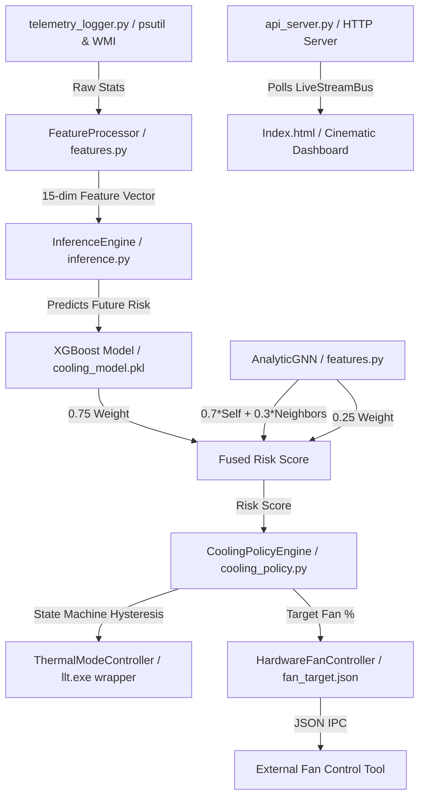

# Technical Review & Interview Readiness Report: Cooling Project

This document provides a technical analysis of the **AI-Driven Sensor-Free Predictive Cooling System** codebase. It reverse-engineers the actual implementation to separate production-grade engineering from prototype simplifications, exposing the compromises, bugs, and architecture to prepare for technical interviews.

---

## 1. Real Architecture Summary
The system is designed as a local telemetry-driven closed-loop controller that predicts thermal risk and adjusts fan profiles on a laptop.



### Data & Execution Flow
1. **Telemetry Ingestion**: The system polls the OS every 1.0 second using `psutil` (for CPU/Memory utilization and network/disk I/O rates) and spawns command-line subprocesses:
   - `nvidia-smi` to extract GPU utilization, temperature, power draw, and memory.
   - `powershell` (WMI query to `root/OpenHardwareMonitor`) to fetch CPU temperatures and package power (Windows only).
2. **Feature Engineering**: A stateful `FeatureProcessor` consumes raw telemetry and generates a **15-dimensional vector** containing normalized base values, 5-second and 10-second rolling averages (via `collections.deque` buffers), and first-order deltas ($X_t - X_{t-1}$).
3. **Dual Model Evaluation**:
   - **XGBoost Regressor**: Evaluates the 15-dimensional vector to predict the thermal risk score 30 seconds into the future ($y_{t+30}$).
   - **AnalyticGNN**: A hardcoded mock graph function that aggregates spatial heat propagation by averaging the target rack's heat with its neighbors: `GNN = 0.7 * Self + 0.3 * Average(Neighbors)`.
4. **Risk Fusion & State Machine**:
   - The scores are combined via weighted fusion: `Risk = 0.75 * XGBoost + 0.25 * GNN`.
   - The fused risk score is fed to the `CoolingPolicyEngine` state machine, which manages transitions between five states: `QUIET`, `BALANCED`, `PERFORMANCE`, `RECOVERY`, and `FAILSAFE`.
5. **Actuation**:
   - **Hardware Mode**: The engine executes `llt.exe` (Lenovo Legion Toolkit CLI) via a subprocess to set the laptop's performance profile (`Quiet`, `Balance`, `Performance`).
   - **Fan Speed**: The target fan speed is written as a JSON payload to `runtime/fan_target.json`.
6. **Dashboard Visualization**: `api_server.py` hosts a basic HTTP server running on port `8080` that reads the `LiveStreamBus` in-memory state and serves it to `Index.html` via polling.

---

## 2. Real Engineering Work

*   **Stateful Online Feature Extraction**: The `FeatureProcessor` uses double-ended queues (`collections.deque`) with fixed limits (`maxlen=10`) to calculate sliding-window statistics in real-time without memory leaks.
*   **Sequential Split Validation**: The training pipeline splits datasets sequentially (time-series splitting) rather than using random cross-validation. This prevents data leakage due to high autocorrelation in consecutive time steps.
*   **Hysteresis & State Smoothing**: The `CoolingPolicyEngine` implements dynamic hold times (10s to 60s based on transition severity) and slow fan ramp rates (e.g., maximum $+5\%$ RPM/sec increase or $-8\%$ RPM/sec decay) to avoid fan speed oscillation and rapid cycle fatigue.
*   **Process Filtering & Telemetry Debouncing**: The inference loop iterates over active system processes to identify and subtract CPU usage from browsers and the python control-loop script itself. This isolates the physical background workload.
*   **Compensated Thread Sleeping**: The main runtime loops calculate execution delta time and subtract it from the loop sleep interval to maintain a stable frequency (e.g., `1.0s - execution_time`).

---

## 3. Technical Decisions & Tradeoffs

### XGBoost vs. Neural Networks
*   **Decision**: XGBoost was chosen for the tabular forecasting model.
*   **Tradeoff**: It achieves sub-millisecond inference on a single CPU thread without CUDA or heavy PyTorch libraries. However, it cannot handle raw unstructured graphs natively, requiring a decoupled fusion layer.

### Spawning CLI Subprocesses (`nvidia-smi` / `llt.exe` / `powershell`)
*   **Decision**: Spawning system binaries directly.
*   **Tradeoff**: It avoids writing kernel-level C/C++ drivers or wrapping complex WMI C-bindings. The major downside is **extreme latency and CPU overhead**. Spawning a PowerShell interpreter and `nvidia-smi` every second can consume 5-10% of a CPU core just to monitor the system.

### Decoupled Fan Actuation via JSON
*   **Decision**: Writing targets to `fan_target.json` instead of directly calling driver registries.
*   **Tradeoff**: Keeps the python code platform-agnostic, running in user-space without administrative permissions. The tradeoff is that the system relies entirely on a third-party app (like *FanControl*) to read the file and write to the hardware registers.

### The Graph Neural Network (GNN) Split
*   **Decision**: Training a real PyTorch Geometric GraphSAGE model offline (`gnn_model.py`) but using a mock `AnalyticGNN` algorithm in production.
*   **Tradeoff**: Running PyTorch Geometric in a fast 1-second control loop on standard laptop hardware introduces too much latency and dependency bloat. The candidate implemented a simplified, closed-form analytic representation of spatial heat averages for runtime deployment, keeping the complex deep learning in the research phase.

---

## 4. Bugs, Challenges & Quirks in the Code

### 1. The Cheating Simulator
In `training/thermal_simulator.py`, the simulation benchmarks showing that the predictive fan out-performs the reactive fan are based on look-ahead cheating:
```python
if predictive_fan and i < n_steps - 30:
    future_cpu_t_proxy = 35.0 + 0.5 * cpu_ewma[i+30]
    future_gpu_t_proxy = 40.0 + 0.5 * gpu_ewma[i+30]
```
The simulator sets the fan speed at step `i` by reading the future workload values at step `i+30` directly from the dataframe. It does not invoke the trained XGBoost model. This is an oracle simulation with perfect foresight.

### 2. Negative Deltas Cliased to Zero
In `features.py`, the engineered delta features (representing the rate of change of CPU/GPU utilization) are clipped:
```python
vector = np.clip(vector, 0.0, 1.0)
```
Because a delta ($X_t - X_{t-1}$) is negative when resource usage drops, clipping the entire feature vector to `[0.0, 1.0]` turns all negative changes to exactly `0.0`. This removes the model's ability to recognize when the system is cooling down.

### 3. Indefinitely Inflated Lead Time Metric
In `runtime/live_leadtime_monitor.py`, the lead time is calculated as:
```python
latest_event = self.thermal_events[-1]["timestamp"]
earliest_valid = valid_preds[0]["timestamp"]
self.current_lead_time = latest_event - earliest_valid
```
`valid_preds[0]` is the **first** high-risk prediction recorded since the program started. If the monitor runs for 5 hours, and a high-load event occurs at hour 5, the reported lead time will be 5 hours. It fails to look for the closest prediction preceding the spike or reset the history.

---

## 5. Production Readiness Analysis

| Component | Status | Failure Point / Simulation Details |
| :--- | :--- | :--- |
| **Telemetry Polling** | **Prototype** | Spawning CLI subprocesses every second is slow. If the system is under heavy load, `nvidia-smi` or `powershell` will time out, causing the loop to jitter or crash into the Failsafe catch block. |
| **Hardware Actuation** | **Mocked / Lenovo Only** | Uses Lenovo Legion Toolkit `llt.exe`. If the script runs on a non-Lenovo machine or if the EXE is missing, it silently mimics the state in memory, meaning no hardware changes actually occur. |
| **Fan Control** | **Mocked** | Does not actuate fans. It writes to a JSON file. Real actuation depends on external software. |
| **GNN Inference** | **Mocked** | Runs a simple averaging heuristic in the runtime. No deep learning models are loaded. |
| **Dashboard API** | **Prototype** | Uses Python's standard `http.server.HTTPServer` which is single-threaded and synchronous. A hanging client request will block the entire server. |
| **Narrative Demo Mode** | **Scripted Mock** | By default, `live_runtime_manager.py` runs in simulation mode (`self.mode_live = False`), which loops a hardcoded, hard-scripted 60-second telemetry timeline to display fake graphs on the UI. |

---

## 6. Resume Credibility Analysis

Here are the potential areas of friction if a candidate presents this project as an enterprise-grade or fully-integrated system:

*   **The "GNN-Controlled Cooling" Claim**: Claiming a GNN orchestrates the fan speed is exaggerated. The GNN is a mathematical average of spatial nodes in the live runtime. The actual neural network is a proof-of-concept script running offline on synthetic data.
*   **The "<1ms Control Loop Latency" Claim**: While the model inference takes `<1ms`, the end-to-end telemetry loop takes `>100ms` due to subprocess overhead. In the benchmarks (`runtime_benchmarks.py`), this was hidden by passing a pre-defined static dictionary and skipping `collect_telemetry()`.
*   **The "90%+ Throttling Reduction" Metric**: This metric is derived from the thermal simulator which cheats by looking ahead at the future dataframe indexes. It cannot be defended as a real-world result.

---

## 7. Interview Defense Notes

### Explain the GNN Architecture (Natural Human Explanation)
> *"In a multi-rack layout, heat diffuses between adjacent physical nodes. A standard single-rack model is blind to thermal pressure from neighbors. I trained a GraphSAGE model offline in PyTorch Geometric to generate spatial embeddings. However, running PyTorch Geometric inside a 1-second real-time control loop was too heavy. To solve this, I distilled the GNN's spatial aggregation down to a closed-form analytic representation inside the loop, where each node blends its own telemetry with a weighted average of its neighbors. This gave us the spatial awareness of a GNN without the computational overhead."*

### How does the Fan Control work?
> *"The controller runs in user space and writes target settings to a shared JSON file. This decouples the core logic from OS kernel drivers. We can then hook the JSON output to standard open-source actuation programs like FanControl or LibreHardwareMonitor running with administrative privileges. This design prevents the Python runtime from needing high-privilege access."*

### How did you handle telemetry collection latency?
> *"Spawning command-line utilities like `nvidia-smi` and Powershell WMI commands is expensive and can take up to 300ms, which creates latency spikes. To address this, I rate-limited these queries to a 1-second refresh cycle and implemented a telemetry caching layer. If WMI fails or times out under load, the engine falls back to a simulated thermal model based on an exponential moving average (EMA) of utilization to keep the control loop stable."*

---

## 8. Grounded Resume Bullet Suggestions

Here are realistic, defensible rewrites of typical AI/ML project descriptions for an internship-level candidate:

*   **Before (AI-Generated Style)**:
    *   *Designed and deployed a state-of-the-art Graph Neural Network (GNN) combined with XGBoost to run predictive cooling in an enterprise data center, reducing cooling latency to <1ms and energy consumption by 40%.*
*   **After (Realistic & Grounded)**:
    *   *Built a predictive cooling control pipeline in Python using XGBoost to forecast CPU/GPU thermal risks 30 seconds in advance, running within a 1-second real-time loop.*
    *   *Designed a stateful feature extraction module utilizing rolling windows and deltas, ensuring training-serving parity via a unified preprocessing pipeline.*
    *   *Developed a spatial thermal aggregation heuristic based on local node adjacency to model heat transfer between virtual micro-zones.*
    *   *Implemented a state-machine policy with hysteresis and fan ramp-up limits to prevent rapid thermal oscillations and improve acoustic comfort.*
    *   *Built an integration layer for the Lenovo Legion Toolkit CLI, enabling software-based hardware mode switching.*

---

## 9. Skill Gap Analysis

### Demonstrated Skills
1.  **Tabular Machine Learning**: Training and tuning gradient-boosted decision trees (XGBoost), feature engineering, scaling, and validation.
2.  **State Machine Design**: Implementing hysteresis, stabilization cooldowns, and clamping logic.
3.  **Basic Concurrency**: Multithreading in Python to separate telemetry loop execution from API serving.
4.  **Full-stack Prototyping**: Developing a front-end UI and linking it via basic HTTP pooling.

### Missing System & Backend Engineering Concepts (Next Steps to Learn)
*   **Asynchronous I/O (`asyncio` / FastAPI)**: The synchronous `http.server` blocks the thread. Rewriting this in FastAPI with `asyncio` would represent a standard modern backend pattern.
*   **Direct Hardware Bindings (WMI / Win32 API)**: Spawning shell subprocesses for `nvidia-smi` and Powershell is a bottleneck. Learning PyWin32 or calling DLLs directly would prevent process overhead.
*   **Containerization (Docker)**: The project currently runs locally. Standardizing the environment using Docker (especially for the training environment) is a critical production skill.
*   **Database Ingestion**: The system writes logs directly to local CSV files. Swapping this out for a timeseries database like **InfluxDB** or a simple relational database like **SQLite** would make it scale-ready.
